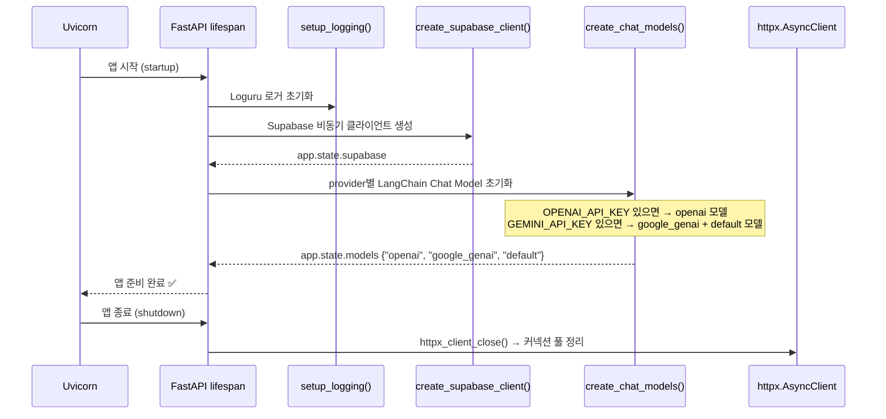
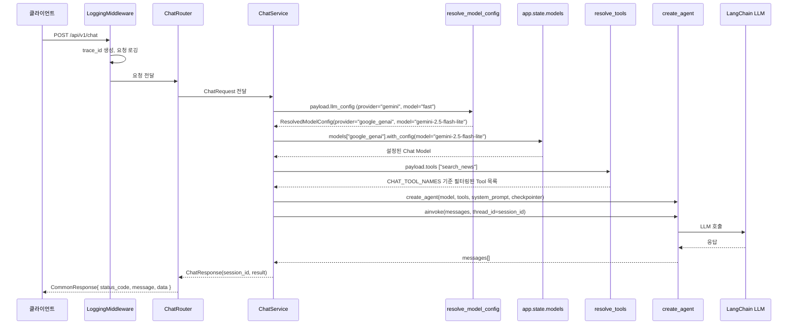
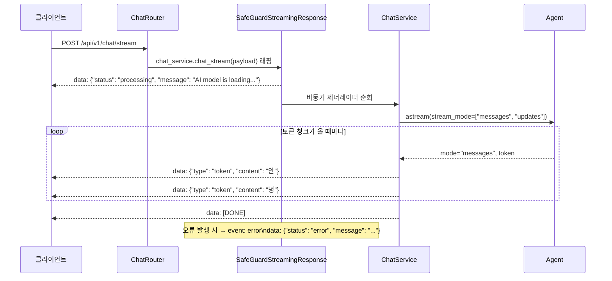
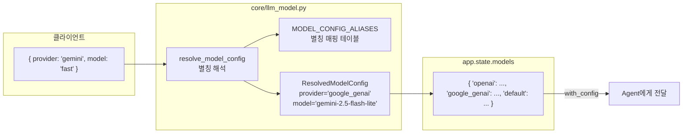
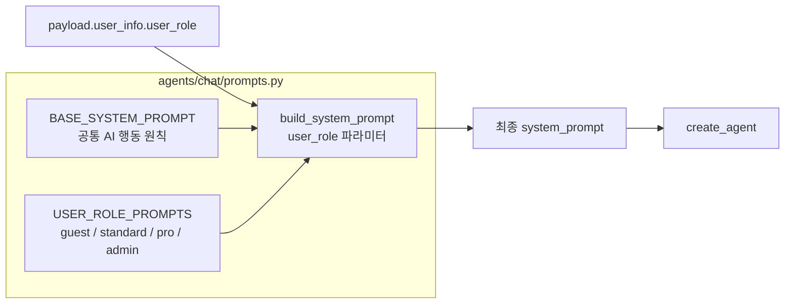
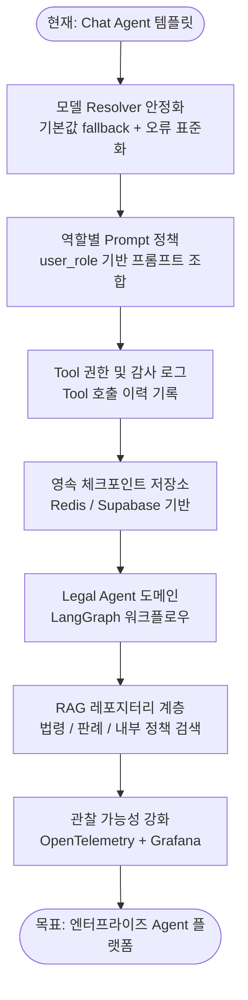
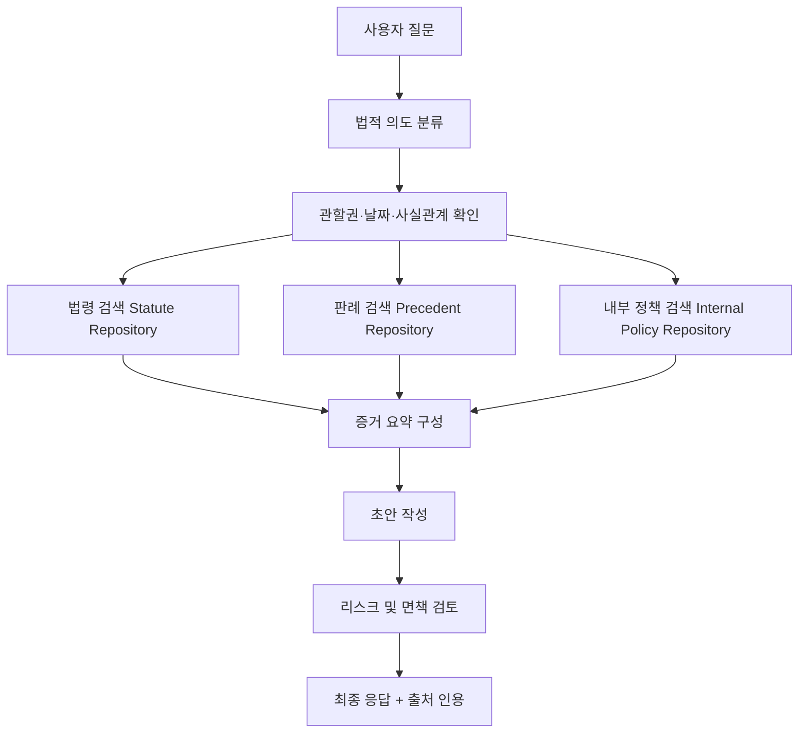

```
██╗      ███████╗  ██████╗  ██████╗  ███████╗ ██╗   ██╗ ███████╗ ███████╗   ███╗  
██║      ██╔════╝ ██╔═══██╗ ██╔══██╗ ██╔════╝ ██║   ██║ ██╔══██║ ██╔══██║  ████║  
██║      █████╗   ██║   ██║ ██║  ██║ █████╗   ██║   ██║ ███████║ ██║  ██║ ╚══██║  
██║      ██╔══╝   ██║   ██║ ██║  ██║ ██╔══╝   ╚██╗ ██╔╝ ╚════██║ ██║  ██║    ██║  
███████╗ ███████╗ ╚██████╔╝ ██████╔╝ ███████╗  ╚████╔╝       ██║ ███████║ ███████╗
╚══════╝ ╚══════╝  ╚═════╝  ╚═════╝  ╚══════╝   ╚═══╝   ╚══════╝ ╚══════╝ ╚══════╝

  FastAPI · LangChain · LangGraph · Supabase
```

# LangChain Agent Backend Template

FastAPI, LangChain, LangGraph를 조합해서 만든 AI Agent 백엔드 템플릿입니다.
멀티 LLM 프로바이더 지원, SSE 스트리밍, Tool 레지스트리, 레포지터리 패턴 등을 직접 실험하고 학습하기 위해 만들었습니다.


---

## 목차

- [주요 설계 결정 요약](#주요-설계-결정-요약)
- [이 프로젝트가 다루는 것들](#이-프로젝트가-다루는-것들)
- [전체 아키텍처](#전체-아키텍처)
- [프로젝트 구조](#프로젝트-구조)
- [앱 구동 흐름](#앱-구동-흐름)
- [핵심 개념 해설](#핵심-개념-해설)
- [요청 처리 흐름](#요청-처리-흐름)
- [스트리밍 흐름](#스트리밍-흐름)
- [모델 Alias 전략](#모델-alias-전략)
- [Tool 설계 패턴](#tool-설계-패턴)
- [Prompt 설계 패턴](#prompt-설계-패턴)
- [설계 패턴 모음](#설계-패턴-모음)
- [API 레퍼런스](#api-레퍼런스)
- [로컬 개발 환경 설정](#로컬-개발-환경-설정)
- [현재 한계점 및 개선 예정](#현재-한계점-및-개선-예정)
- [엔터프라이즈 로드맵](#엔터프라이즈-로드맵)
- [기술 스택 정리](#기술-스택-정리)

---

## 주요 설계 결정 요약

| 영역 | 현재 설계 |
|---|---|
| API 프레임워크 | FastAPI app factory + 라우터 분리 등록 |
| Agent 오케스트레이션 | LangChain `create_agent` |
| 모델 라우팅 | `provider` + `model` alias → LangChain provider/model 변환 |
| 모델 생명주기 | 앱 시작 시 provider별 base model 생성 → `app.state.models` 보관 |
| 요청별 모델 결정 | `resolve_model_config()` → `with_config(configurable={"model": ...})` |
| 메모리/체크포인트 | 모듈 레벨 `InMemorySaver`, `thread_id=session_id` |
| 컨텍스트 관리 | `SummarizationMiddleware(trigger=12, keep=10)` |
| Tool 설계 | 공통 Tool 레지스트리 + Agent별 허용 toolset 분리 |
| Tool 후처리 Hook | `inject_tool_guidance` (`@before_model`) - Tool 실행 직후 가이드 프롬프트 자동 주입 |
| 외부 HTTP 호출 | 공유 `httpx.AsyncClient` (커넥션 풀 + 이벤트 훅 로깅) |
| 레포지터리 패턴 | Protocol 기반 인터페이스 → Supabase / Mock / SQLAlchemy 교체 가능 |
| 관찰 가능성 씨앗 | Loguru, 요청 미들웨어, LangSmith 트레이싱 환경변수, trace_id |
| 복원력 유틸 | `retry_async`, `MemoryCache` (TTL + double-check lock) |
| SSE 안전망 | `SafeGuardStreamingResponse` - 스트림 오류를 SSE error 이벤트로 변환 |

---

## 이 프로젝트가 다루는 것들

```text
✅ 현재 구현된 것
├── 일반 채팅 Agent (Chat Agent)
├── Provider/Model Alias 해석
├── SSE 스트리밍 응답
├── LangGraph InMemorySaver 체크포인터
├── SummarizationMiddleware (대화 요약/압축)
├── inject_tool_guidance Hook (@before_model) - Tool 실행 후 가이드 프롬프트 자동 주입
├── 공통 Tool 레지스트리
│   ├── get_weather       (샘플 날씨 Tool)
│   ├── search_news       (네이버 뉴스 검색)
│   ├── news_search       (langchain-naver-community 뉴스)
│   ├── blog_search       (langchain-naver-community 블로그)
│   └── web_search        (langchain-naver-community 웹 검색)
├── Supabase 레포지터리 패턴 (DB 헬스체크)
├── 공통 HTTP 클라이언트 (커넥션 풀, 로깅 훅)
├── 전역 예외 핸들러
└── 요청 추적 미들웨어 (trace_id, 소요 시간)

🚧 구조만 준비된 것 (미구현)
├── Legal Agent (agents/legal_agent/ - 파일 등록, 로직 미구현)
├── Legal Agent Router (POST /api/v1/legal/chat - 연결만 완료)
├── Legal Tools (agents/tools/legal/ - 빈 폴더)
└── Chat Repository (repositories/chat/ - 빈 폴더)
```

---

## 전체 아키텍처

```mermaid
flowchart TB
    subgraph 클라이언트
        Client[Client / Next.js Frontend]
    end

    subgraph FastAPI 앱
        subgraph 미들웨어 계층
            CORS[CORSMiddleware]
            LOG[LoggingMiddleware\ntrace_id 생성·소요시간 기록]
        end

        subgraph API 계층
            HealthRouter[health_router.py\nGET /health\nPOST /health/database\nGET /error]
            ChatRouter[chat_router.py\nPOST /api/v1/chat\nPOST /api/v1/chat/stream\nGET /api/v1/tools]
            LegalRouter[legal_agent_router.py\nPOST /api/v1/legal/chat]
        end

        subgraph 서비스 계층
            HealthService[HealthService]
            ChatService[ChatService]
            LegalAgentService[LegalAgentService\n⚠️ 로직 미구현]
        end

        subgraph Agent 계층
            Resolver[resolve_model_config\nAlias 해석]
            Prompt[build_system_prompt\n역할별 프롬프트]
            Toolset[resolve_chat_tools\nAgent 허용 Tool 필터]
            Agent[create_agent\nLangChain Agent]
            Checkpoint[InMemorySaver\nthread_id=session_id]
            Summary[SummarizationMiddleware\n12개 초과 시 요약]
            InjectHook[inject_tool_guidance\n@before_model Hook]
        end

        subgraph Tool 계층
            Registry[COMMON_TOOLS 레지스트리]
            Weather[get_weather\n샘플 날씨 Tool]
            News[search_news\n네이버 뉴스]
            NaverNews2[news_search\nlangchain-naver-community]
            NaverBlog[blog_search\nlangchain-naver-community]
            NaverWeb[web_search\nlangchain-naver-community]
        end

        subgraph 인프라 계층
            Models[app.state.models\nLangChain Chat Models]
            Supabase[app.state.supabase\nSupabase AsyncClient]
            HttpClient[httpx.AsyncClient\n공유 커넥션 풀]
            SSE[SafeGuardStreamingResponse\nSSE 오류 안전망]
        end

        subgraph 레포지터리 계층
            HealthRepo[HealthRepositoryProtocol]
            SupabaseRepo[HealthSupabaseRepository]
            MockRepo[HealthMockRepository]
        end
    end

    subgraph 외부
        OpenAI[OpenAI API]
        Gemini[Google Gemini API]
        NaverNews[Naver News API]
        SupabaseDB[(Supabase DB)]
        LangSmith[LangSmith 트레이싱]
    end

    Client -->|HTTP| CORS --> LOG
    LOG --> HealthRouter & ChatRouter
    ChatRouter --> ChatService
    HealthRouter --> HealthService
    ChatService --> Resolver --> Models
    ChatService --> Prompt
    ChatService --> Toolset --> Registry
    Registry --> Weather & News & NaverNews2 & NaverBlog & NaverWeb
    NaverNews2 & NaverBlog & NaverWeb --> NaverNews
    ChatService --> Agent --> Checkpoint & Summary & InjectHook
    LegalRouter --> LegalAgentService
    Agent --> Models
    Models --> OpenAI & Gemini
    HealthService --> HealthRepo --> SupabaseRepo --> Supabase --> SupabaseDB
    ChatRouter --> SSE
    Models -.->|선택적| LangSmith
```

---

## 프로젝트 구조

```text
sample01/
├── backend/                        # Python FastAPI 백엔드
│   ├── app/
│   │   ├── main.py                 # FastAPI 앱 팩토리 + lifespan
│   │   │
│   │   ├── api/                    # API 계층
│   │   │   ├── routes.py           # 라우터 등록 함수
│   │   │   └── endpoints/
│   │   │       ├── chat_router.py        # /api/v1/chat, /stream, /tools
│   │   │       ├── legal_agent_router.py # /api/v1/legal/chat (⚠️ 로직 미구현)
│   │   │       └── health_router.py      # /health, /health/database, /error
│   │   │
│   │   ├── agents/                 # Agent 계층
│   │   │   ├── chat/
│   │   │   │   ├── prompts.py          # 시스템 프롬프트 + Tool별 가이드 프롬프트
│   │   │   │   ├── toolset.py          # resolve_chat_tools() - 공통 레지스트리 위임
│   │   │   │   └── custom_middleware.py # inject_tool_guidance (@before_model Hook)
│   │   │   ├── legal_agent/        # (파일 등록, 로직 미구현)
│   │   │   │   ├── graph.py        # LangGraph 워크플로우 (빈 파일)
│   │   │   │   ├── state.py        # 상태 스키마 (빈 파일)
│   │   │   │   ├── prompts.py      # 법률 특화 프롬프트 (빈 파일)
│   │   │   │   └── toolset.py      # Legal Agent 허용 Tool (빈 파일)
│   │   │   └── tools/
│   │   │       ├── registry.py     # COMMON_TOOLS 카탈로그 + resolve_tools()
│   │   │       ├── common/
│   │   │       │   ├── weather_tool.py       # 샘플 날씨 Tool
│   │   │       │   ├── news_tool.py          # 네이버 뉴스 API Tool
│   │   │       │   └── naver_search_tools.py # langchain-naver-community (뉴스/블로그/웹)
│   │   │       └── legal/          # (준비 중 - 빈 폴더)
│   │   │
│   │   ├── services/               # 비즈니스 로직 계층
│   │   │   ├── chat_service.py          # Agent 생성·호출·스트리밍
│   │   │   ├── legal_agent_service.py   # Legal Agent 서비스 (⚠️ 로직 미구현)
│   │   │   └── health_service.py        # DB 헬스체크
│   │   │
│   │   ├── repositories/           # 데이터 접근 계층
│   │   │   ├── health/
│   │   │   │   ├── protocol.py          # HealthRepositoryProtocol (인터페이스)
│   │   │   │   ├── supabase_repository.py
│   │   │   │   ├── mock_repository.py
│   │   │   │   └── sqlalchemy_repository.py
│   │   │   └── chat/               # (준비 중 - 빈 폴더)
│   │   │
│   │   ├── schemas/                # Pydantic 스키마
│   │   │   ├── chat.py             # ChatRequest, ChatResponse, LlmConfig, UserInfo
│   │   │   ├── legal.py            # LegalChatResponse
│   │   │   ├── health.py           # HealthRequest
│   │   │   └── response.py         # CommonResponse[T] 공통 응답 래퍼
│   │   │
│   │   ├── core/                   # 핵심 설정 계층
│   │   │   ├── config.py           # pydantic-settings (.env 로딩)
│   │   │   ├── dependencies.py     # FastAPI Depends 함수 모음
│   │   │   ├── llm_model.py        # 모델 Alias 해석 + 초기화
│   │   │   └── supabase.py         # Supabase AsyncClient 팩토리
│   │   │
│   │   ├── base/                   # 공통 인프라 계층
│   │   │   ├── middleware.py       # LoggingMiddleware (trace_id, 소요시간)
│   │   │   ├── exceptions.py       # 전역 예외 핸들러 등록
│   │   │   ├── sse.py              # SafeGuardStreamingResponse
│   │   │   ├── http_client.py      # 공유 httpx.AsyncClient (Double-check Lock)
│   │   │   ├── embedding_client.py # 임베딩 클라이언트 (retry + circuit breaker)
│   │   │   ├── context.py          # trace_id ContextVar
│   │   │   └── logger.py           # Loguru 설정
│   │   │
│   │   └── utils/                  # 유틸리티
│   │       ├── retry.py            # retry_async (지수 백오프)
│   │       ├── circuit_breaker.py  # (미완성 - retry.py와 내용 동일)
│   │       └── in_memory_cache.py  # TTLCache + asyncio.Lock Double-check
│   │
│   ├── requirements.txt
│   └── Dockerfile
│
└── frontend/                       # Next.js 프론트엔드
    ├── src/app/
    │   ├── page.tsx
    │   └── layout.tsx
    ├── package.json
    └── Dockerfile
```

---

## 앱 구동 흐름



> **핵심 원칙**: 무거운 클라이언트(DB, LLM, HTTP)는 **앱 시작 시 딱 한 번** 만들어 `app.state`에 보관합니다.
> 요청마다 생성하면 연결 비용이 폭발하기 때문입니다.

---

## 핵심 개념 해설

> 초심자를 위한 "왜 이렇게 짰는가" 설명입니다.

### 1️⃣ 계층 분리란?

이 프로젝트는 코드를 역할에 따라 **명확히 분리**합니다.

```text
┌──────────────────────────────────────────────────────────────┐
│  Client  →  Router  →  Service  →  Agent  →  Tool  →  LLM   │
│              (API)    (비즈니스)  (오케스트레이션)  (외부)      │
└──────────────────────────────────────────────────────────────┘
```

- **Router**: HTTP 요청을 받아 Service로 전달. 비즈니스 로직 없음
- **Service**: 핵심 비즈니스 로직. Agent를 조립하고 호출
- **Agent**: LLM + Tool + Memory 조합. LangChain이 관리
- **Repository**: DB 접근만 담당. 인터페이스로 추상화되어 있어 Supabase↔Mock 교체 가능

### 2️⃣ FastAPI `Depends`란?

```python
# chat_router.py
async def chat(
    payload: ChatRequest,
    chat_service: ChatService = Depends(ChatService),  # ← 의존성 주입
):
```

`Depends`는 FastAPI의 **의존성 주입(DI)** 시스템입니다.
`ChatService`가 필요로 하는 `models`(`get_chat_models`)를 FastAPI가 자동으로 꺼내서 넣어줍니다.
직접 `app.state.models`에 접근하지 않아도 됩니다.

### 3️⃣ LangGraph 체크포인터란?

```python
CHAT_CHECKPOINTER = InMemorySaver()  # 모듈 레벨 (앱 전체 공유)

agent.ainvoke(
    {"messages": [...]},
    config={"configurable": {"thread_id": session_id}}  # ← 대화 식별자
)
```

`thread_id`가 같은 요청은 **이전 대화 내용을 기억**합니다.
`InMemorySaver`는 서버 메모리에 저장하므로 서버 재시작 시 초기화됩니다.
운영 환경에서는 Redis나 DB 기반 저장소로 교체가 필요합니다.

### 4️⃣ SSE(Server-Sent Events)란?

```text
클라이언트                           서버
    │                                  │
    │──── POST /api/v1/chat/stream ────→│
    │                                  │
    │←── data: {"status": "processing"}│  (즉시 응답 시작)
    │←── data: {"type": "token", ...}  │  (토큰 조각씩 전송)
    │←── data: {"type": "token", ...}  │
    │←── data: [DONE]                  │  (완료)
    │                                  │
```

HTTP 연결을 유지한 채 서버가 데이터를 **조금씩 밀어 넣는** 방식입니다.
ChatGPT처럼 글자가 하나씩 타이핑되듯 나오는 효과를 구현할 때 사용합니다.

---

## 요청 처리 흐름



---

## 스트리밍 흐름



> `SafeGuardStreamingResponse`가 오류를 잡아 클라이언트에 안전한 에러 이벤트로 변환합니다.
> 일반 HTTP 엔드포인트의 전역 예외 핸들러 역할을 스트림 레이어에서 수행합니다.

---

## 모델 Alias 전략

클라이언트는 LangChain 내부 이름을 몰라도 됩니다.
프론트엔드 친화적인 `alias`로 요청하면, 서버가 내부적으로 정확한 provider와 model명으로 변환합니다.

```text
클라이언트 요청                    서버 내부 변환
─────────────────────────────────────────────────────────────
provider="gemini",  model="fast"    →  provider="google_genai", model="gemini-2.5-flash-lite"
provider="gemini",  model="advanced"→  provider="google_genai", model="gemini-3-flash-preview"
provider="chatgpt", model="fast"    →  provider="openai",       model="gpt-5-nano"
provider="chatgpt", model="advanced"→  provider="openai",       model="gpt-5"
provider="grok",    model="fast"    →  provider="xai",          model="grok-beta"  ⚠️ 미구현
```



**핵심**: 모델 pool은 provider 단위로만 만들고, 실제 model 이름은 `with_config()`로 요청마다 교체합니다.
따라서 새 모델 추가 시 alias 테이블만 수정하면 됩니다.

---

## Tool 설계 패턴

Tool 구현과 Agent별 허용 목록을 **분리**합니다.
하나의 Tool 구현체를 여러 Agent에서 재사용할 수 있습니다.

```mermaid
flowchart TD
    subgraph Tool 구현
        W[weather_tool.py\nget_weather]
        N[news_tool.py\nsearch_news]
    end

    subgraph 레지스트리
        REG[tools/registry.py\nCOMMON_TOOLS]
    end

    subgraph Agent별 Toolset
        CT[chat/toolset.py\nCHAT_TOOL_NAMES\n['get_weather','search_news']]
        LT[legal/toolset.py\n준비 중...]
    end

    W --> REG
    N --> REG
    REG --> CT
    REG --> LT
    CT --> CA[Chat Agent]
    LT --> LA[Legal Agent]
```

| Tool | 방식 | 설명 |
|---|---|---|
| `get_weather` | 동기(sync) | 샘플 날씨 응답 (목업) |
| `search_news` | 비동기(async) | 공유 `httpx.AsyncClient`로 네이버 뉴스 API 호출 |

> `GET /api/v1/tools`는 `COMMON_TOOLS` 전체 목록을 반환합니다.
> `POST /api/v1/chat`에서는 `payload.tools`를 `chat/toolset.py`의 `CHAT_TOOL_NAMES` 기준으로 필터링합니다.

---

## Prompt 설계 패턴

시스템 프롬프트를 **역할(role)별로 분리** 관리합니다.



현재는 역할 조합이 비활성화되어 `BASE_SYSTEM_PROMPT`만 사용합니다.
다음 단계에서 `user_role`을 반영하면 역할별로 다른 응답 스타일을 적용할 수 있습니다.

---

## 설계 패턴 모음

### 패턴 1 | App Lifecycle 리소스 패턴

```python
# main.py - 앱 시작 시 한 번만 생성
app.state.supabase = await create_supabase_client()
app.state.models = create_chat_models()

# dependencies.py - 요청마다 꺼내서 사용
async def get_chat_models(request: Request) -> dict:
    return getattr(request.app.state, "models", None)
```

`app.state`를 애플리케이션 범위 리소스 컨테이너로 활용합니다.
별도의 싱글톤 클래스 없이 FastAPI가 제공하는 기능만으로 충분합니다.

### 패턴 2 | Alias Resolver 패턴

```text
클라이언트 친화적 이름  →  내부 LangChain 이름
provider="gemini"      →  provider="google_genai"
model="fast"           →  model="gemini-2.5-flash-lite"
```

프론트엔드가 LangChain 내부 provider 이름에 종속되지 않습니다.
모델 교체 시 `MODEL_CONFIG_ALIASES` 테이블만 수정하면 됩니다.

### 패턴 3 | Tool Registry + Agent Toolset 패턴

```text
Tool 구현 → 공통 레지스트리(COMMON_TOOLS) → Agent별 허용 목록(toolset.py) → create_agent()
```

각 Agent는 전체 Tool 중 자신이 허용하는 것만 사용합니다.
Tool 구현과 Agent 정책이 분리되어 있어 유지보수가 쉽습니다.

### 패턴 4 | 요청 범위(Request-Scoped) Agent 패턴

```text
캐싱 O (앱 수명 동안 재사용):   provider model 클라이언트
                                 HTTP 클라이언트
                                 DB 클라이언트

캐싱 X (요청마다 새로 생성):     Agent 인스턴스 자체
                                 (model, tools, prompt가 요청마다 다를 수 있음)
```

대화 연속성은 Agent 객체 캐싱이 아니라 **체크포인터 + thread_id**로 보장합니다.

### 패턴 5 | Repository Protocol 패턴

```python
# protocol.py - 인터페이스만 정의
class HealthRepositoryProtocol(Protocol):
    async def select_one(self, schema_name: str, table_name: str): ...

# dependencies.py - 구현체 교체 한 줄로 가능
repository: HealthRepositoryProtocol = Depends(HealthSupabaseRepository)
# repository: HealthRepositoryProtocol = Depends(HealthMockRepository)  # 목 교체
```

Service 코드를 변경하지 않고 DB 구현체를 교체할 수 있습니다.

### 패턴 6 | Double-Check Lock 패턴

```python
# http_client.py - 비동기 환경의 안전한 싱글톤 생성
if httpx_client is None:
    async with httpx_client_lock:           # 임계 구역 진입
        if httpx_client is None:            # 한 번 더 확인 (Double-check)
            httpx_client = httpx.AsyncClient(...)
```

동시 요청이 몰려도 클라이언트가 딱 한 번만 생성되도록 보장합니다.

### 패턴 7 | SafeGuard SSE 패턴

```python
class SafeGuardStreamingResponse(StreamingResponse):
    async def _safe_wrapper(self, generator):
        try:
            async for chunk in generator:
                yield chunk
        except asyncio.CancelledError:
            logger.info("클라이언트 연결 끊김")
            raise
        except Exception as e:
            logger.error(f"SSE 오류: {e}")
            yield f'event: error\ndata: {json.dumps(...)}\n\n'
```

스트리밍 중 발생하는 오류를 SSE `event: error`로 변환해 클라이언트에게 전달합니다.

---

## API 레퍼런스

| 메서드 | 경로 | 설명 |
|---|---|---|
| `GET` | `/` | `/docs`로 리다이렉트 |
| `GET` | `/health` | 애플리케이션 헬스체크 |
| `GET` | `/error` | 오류 응답 샘플 |
| `POST` | `/health/database` | Supabase 테이블 조회 헬스체크 |
| `GET` | `/api/v1/tools` | 사용 가능한 Tool 카탈로그 |
| `POST` | `/api/v1/chat` | Agent 채팅 (단일 응답) |
| `POST` | `/api/v1/chat/stream` | Agent 채팅 (SSE 스트리밍) |

> Swagger UI: `http://localhost:8080/docs`

### 채팅 요청 예시

```http
POST /api/v1/chat
Content-Type: application/json
```

```json
{
  "session_id": "session-001",
  "llm_config": {
    "provider": "gemini",
    "model": "fast"
  },
  "user_info": {
    "user_id": "user-001",
    "user_name": "홍길동",
    "user_email": "test@example.com",
    "user_role": "guest"
  },
  "message": "삼성전자 관련 최신 뉴스를 찾아줘",
  "tools": ["search_news"]
}
```

```json
{
  "status_code": 200,
  "message": "요청이 완료되었습니다.",
  "data": {
    "session_id": "session-001",
    "result": "삼성전자 관련 최신 뉴스를 검색했습니다. ..."
  }
}
```

### SSE 스트리밍 예시

```http
POST /api/v1/chat/stream
Content-Type: application/json
```

```text
data: {"status": "processing", "message": "AI model is loading..."}

data: {"type": "token", "content": "삼"}
data: {"type": "token", "content": "성"}
data: {"type": "token", "content": "전"}
data: {"type": "token", "content": "자"}

data: [DONE]
```

### Tool 카탈로그 예시

```http
GET /api/v1/tools
```

```json
{
  "status_code": 200,
  "message": "요청이 완료되었습니다.",
  "data": [
    {
      "name": "get_weather",
      "description": "Get current weather information for a location."
    },
    {
      "name": "search_news",
      "description": "최신 뉴스 검색이 필요할 때 사용하는 도구입니다. 키워드로 네이버 뉴스 검색 결과를 가져옵니다."
    }
  ]
}
```

### 공통 응답 스키마

```text
CommonResponse[T]
├── status_code: int       # HTTP 상태 코드
├── message: str           # 한국어 메시지
└── data: T | None         # 실제 응답 데이터

오류 응답 (예외 핸들러)
├── success: false
├── error_code: int
├── message: str
└── detail: any            # 상세 오류 정보
```

---

## 로컬 개발 환경 설정

### 1. 백엔드 `.env` 파일

`backend/.env.example`을 복사해서 `.env`를 만드세요.

```env
# 앱 기본 설정
APP_NAME=Sample FastAPI
APP_VERSION=0.1.0
APP_ENV=local
APP_LOG_LEVEL=DEBUG
APP_HOST=0.0.0.0
APP_PORT=8080

# LLM API 키 (하나 이상 필수)
OPENAI_API_KEY=your-openai-api-key
GEMINI_API_KEY=your-gemini-api-key

# Supabase (DB 헬스체크 기능 사용 시 필요)
SUPABASE_URL=https://your-project.supabase.co
SUPABASE_KEY=your-supabase-anon-key

# LangSmith 트레이싱 (선택 - false면 비활성화)
LANGCHAIN_TRACING_V2=false
LANGCHAIN_API_KEY=your-langsmith-api-key
LANGCHAIN_ENDPOINT=https://api.smith.langchain.com

# 네이버 뉴스 API (search_news Tool 사용 시 필요)
NAVER_CLIENT_ID=your-naver-client-id
NAVER_CLIENT_SECRET=your-naver-client-secret
```

### 2. 백엔드 실행

```bash
cd backend

# 가상 환경 생성 및 활성화
python -m venv .venv

# Windows
.venv\Scripts\activate

# macOS / Linux
source .venv/bin/activate

# 패키지 설치
pip install -r requirements.txt

# 개발 서버 실행
uvicorn app.main:app --host 0.0.0.0 --port 8080 --reload
```

### 3. Swagger UI 확인

```
http://localhost:8080/docs
```

### 4. Docker로 실행

```bash
cd backend
docker build -t agent-backend .
docker run -p 8080:8080 --env-file .env agent-backend
```

### 5. Kubernetes (Helm)으로 배포

쿠버네티스 배포를 위한 Helm 차트를 제공합니다. 운영 환경에서는 Uvicorn 단독 구동 대신 Gunicorn(Multi-Worker) 프로세스 매니저를 사용하여 프로세스 안정성을 확보합니다.

```bash
# Helm 템플릿 검증
helm template my-release backend/helm

# Helm 차트 배포
helm install my-release backend/helm -n <namespace>
```

#### 주요 배포 환경설정 (`backend/helm/values.yaml`)
- **Gunicorn 프로세스 설정 (`service.worker`, `service.workerTimeout`)**:
  - `service.worker`: CPU/Memory 할당량에 맞춰 컨테이너 내부의 비동기 워커(UvicornWorker) 개수를 제어합니다.
  - `service.workerTimeout`: LLM 응답 지연 및 SSE 스트리밍 통신 유지를 위해 충분히 긴 타임아웃(기본값 `180`초)을 설정합니다.
- **애플리케이션 환경 변수 (`env.app`)**:
  - 앱 이름, 구동 환경, 포트, 로그 레벨을 단일 소스로 정의하여 컨테이너 `ConfigMap`을 통해 주입합니다.
- **민감 데이터 보안 (`env.llm`, `env.supabase`, `env.naver`)**:
  - API Key 및 DB 인증 정보는 배포 시 쿠버네티스 `Secret` 리소스로 인프라 보안 레이어에서 안전하게 분리 보관합니다.

---

## 현재 한계점 및 개선 예정

```text
┌──────────────────────────────┬────────────────────────────────────────────────────────────┐
│ 영역                         │ 현재 한계                                                  │
├──────────────────────────────┼────────────────────────────────────────────────────────────┤
│ llm_config                   │ provider/model이 nullable이지만 resolver는 유효값을 요구함  │
│                              │ → 기본값 fallback 로직 없음                                │
├──────────────────────────────┼────────────────────────────────────────────────────────────┤
│ grok/xAI 모델                │ alias 선언은 있으나 startup 모델 초기화 미구현              │
│                              │ → xai provider로 요청 시 KeyError 발생                    │
├──────────────────────────────┼────────────────────────────────────────────────────────────┤
│ InMemorySaver                │ 서버 재시작 시 대화 기록 전체 소실                         │
│                              │ → 운영에는 Redis / DB 기반 저장소 필요                    │
├──────────────────────────────┼────────────────────────────────────────────────────────────┤
│ circuit_breaker.py           │ utils/retry.py와 파일 내용이 동일 (복사 실수로 추정)       │
│                              │ → 실제 상태 기반 Circuit Breaker 로직 미구현               │
├──────────────────────────────┼────────────────────────────────────────────────────────────┤
│ Tool 목록 엔드포인트          │ GET /api/v1/tools는 COMMON_TOOLS 전체 반환                │
│                              │ → 클라이언트가 허용 Tool 목록을 Agent별로 구분 불가        │
├──────────────────────────────┼────────────────────────────────────────────────────────────┤
│ search_news 반환 타입        │ 어노테이션은 list[dict]이나 실제 반환은 JSON 문자열         │
├──────────────────────────────┼────────────────────────────────────────────────────────────┤
│ user_role 프롬프트 조합       │ USER_ROLE_PROMPTS 정의는 있으나 build_system_prompt에서    │
│                              │ 역할 조합이 주석 처리되어 있어 현재 미사용 상태             │
├──────────────────────────────┼────────────────────────────────────────────────────────────┤
│ CORS                         │ allow_origins=["*"] - 로컬 개발용 설정                    │
│                              │ → 운영 배포 시 Vercel 도메인 등으로 제한 필요              │
├──────────────────────────────┼────────────────────────────────────────────────────────────┤
│ 테스트 코드                  │ 단위 테스트 / 통합 테스트 전무                            │
└──────────────────────────────┴────────────────────────────────────────────────────────────┘
```

### 권장 개선 순서

1. `llm_config` 누락 시 기본 provider/model fallback 처리
2. `grok/xAI` alias 제거 또는 startup 모델 초기화 구현
3. `search_news` 반환 타입 어노테이션 수정 (`-> str`)
4. `/api/v1/tools` 반환을 Agent 종류별로 파라미터화 (e.g. `?agent=chat`)
5. `user_role` 프롬프트 조합 활성화 (`build_system_prompt` 주석 해제)
6. `circuit_breaker.py` 실제 상태 머신(Closed/Open/Half-Open) 구현
7. `InMemorySaver` → Redis 기반 영속 저장소 교체
8. 모델 resolver / toolset / prompt builder 단위 테스트 작성
9. Legal Agent 스캐폴딩 구현

---

## 엔터프라이즈 로드맵



### 향후 Legal Agent 구조 (예정)



```text
예정 파일 구조
backend/app
├── agents/
│   └── legal_agent/
│       ├── graph.py        # LangGraph 워크플로우 정의
│       ├── state.py        # 상태 스키마
│       ├── prompts.py      # 법률 특화 프롬프트
│       └── toolset.py      # 법률 Agent 허용 Tool 목록
├── repositories/
│   └── legal/
│       ├── statute_repository.py        # 법령 레포지터리
│       ├── precedent_repository.py      # 판례 레포지터리
│       └── internal_policy_repository.py
├── services/
│   └── legal_agent_service.py
└── api/endpoints/
    └── legal_agent_router.py
```

---

## 기술 스택 정리

| 분류 | 기술 |
|---|---|
| 언어 | Python 3.12 |
| API 프레임워크 | FastAPI 0.115 |
| 설정 관리 | pydantic-settings |
| 로깅 | Loguru |
| Agent 프레임워크 | LangChain |
| 워크플로우 / 메모리 | LangGraph |
| LLM 프로바이더 | Google Gemini, OpenAI (xAI Grok 선언됨) |
| 데이터베이스 클라이언트 | Supabase (AsyncClient) |
| 외부 HTTP 클라이언트 | httpx.AsyncClient |
| 이벤트 루프 최적화 | uvloop (Linux/macOS 환경) |
| 프론트엔드 | Next.js, React, TypeScript |
| 컨테이너 | Docker |
| 배포 | Helm (Kubernetes) |
| 트레이싱 (선택) | LangSmith |
